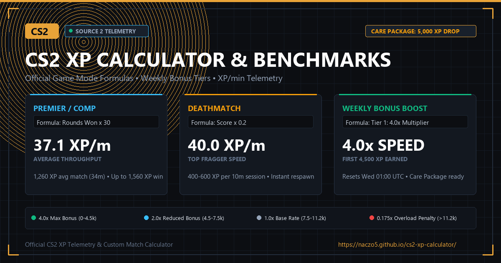

# Counter-Strike 2 (CS2) XP Calculator & Benchmarks

[](https://naczo5.github.io/cs2-xp-calculator/)
[](https://store.steampowered.com/app/730/CounterStrike_2/)
[](https://opensource.org/licenses/MIT)



An interactive calculator, rate comparison, and guide comparing **Match Duration**, **XP Awarded**, and **XP Throughput per Minute** across all official game modes in **Counter-Strike 2 (CS2)**.

**Live Website:** [https://naczo5.github.io/cs2-xp-calculator/](https://naczo5.github.io/cs2-xp-calculator/)

---

## ⚡ Core Features

- **🎮 Custom Match Calculator:** Set rounds won or scoreboard points, adjust match durations, and toggle weekly multiplier tiers to see live XP payouts, XP/min rates, and matches needed for your weekly drop.
- **📊 Mode Efficiency Benchmarks:** Real-world comparison table sorted dynamically by throughput (XP per minute) for both 50% average winrates and clean regulation victories.
- **🔄 Live Weekly Reset Countdown & Popup:** Real-time countdown timer to the CS2 weekly drop reset (Wednesdays at 01:00 UTC), complete with a hover popup displaying your local and UTC reset times.
- **📈 Multiplier Progression Curve:** Full breakdown of the weekly bonus pool from Tier 1 (4.0×) down to the Tier 4 Reduced XP penalty (0.175×).
- **🎯 Weekly Drop & Medal Estimator:** Track estimated play time to reach your 5,000 XP weekly Care Package and annual Service Medal goals.

---

## 📐 Official CS2 XP Calculation Formulas

### 1. Objective Round-Based Modes
In competitive matchmaking, **individual kills, assists, MVP stars, and scores award zero additional XP**. XP is awarded purely based on rounds won by your team:

| Game Mode | Formula | Max Base XP (Regulation) | Overtime / Cap |
| :--- | :--- | :---: | :---: |
| **Premier & Competitive** | `Rounds Won × 30` | 390 XP (13 wins) | 480 XP (16 wins in OT) |
| **Wingman (2v2)** | `Rounds Won × 15` | 135 XP (9 wins) | 135 XP (MR8) |
| **Rush (3v3)** | `Rounds Won × 10` | 80 XP (8 wins) | 60 XP (Fast 4-round lead) |

> *Note:* Even on a loss, you keep all XP earned for the rounds your team won (e.g. 8 rounds won in Premier yields `8 × 30 = 240 Base XP`).

### 2. Arcade Score-Based Modes
In casual and practice modes, XP scales directly with your personal in-game scoreboard score:

| Game Mode | Formula | Benchmark Target | Average Base XP |
| :--- | :--- | :---: | :---: |
| **Casual (10v10)** | `Score × 4.0` | 35 score pts | 140 Base XP |
| **Deathmatch** | `Score × 0.2` | 500 score pts | 100 Base XP *(Anti-bot cap applied)* |
| **Retakes** | `Score × 2.0` | 30 score pts | 60 Base XP |
| **Arms Race** | `Score × 1.0` | 50 weapon score | 50 Base XP |

---

## 🏆 Game Mode Throughput Benchmarks (Average 50% Winrate)

Ranked by **XP per Minute** under the default **Tier 1 Max Weekly Bonus (4.0× Multiplier)**:

| Rank | Game Mode | Match Time | Score / Wins | Total XP (4x) | Throughput | Hours to 5,000 XP Drop |
| :---: | :--- | :---: | :---: | :---: | :---: | :---: |
| **#1** | **Deathmatch** | 10.0 min | 500 pts | **400 XP** | **40.0 XP/m** | **~2.1 hrs** |
| **#2** | **Premier / Comp** | 34.0 min | 10.5 rounds | **1,260 XP** | **37.1 XP/m** | **~2.3 hrs** |
| **#3** | **Wingman (2v2)** | 12.0 min | 7.0 rounds | **420 XP** | **35.0 XP/m** | **~2.4 hrs** |
| **#4** | **Rush (3v3)** | 7.5 min | 5.5 rounds | **220 XP** | **29.3 XP/m** | **~2.8 hrs** *(Up to 46.0 XP/m on fast 4-round lead wins)* |
| **#5** | **Casual (10v10)** | 22.0 min | 35 pts | **560 XP** | **25.5 XP/m** | **~3.3 hrs** |
| **#6** | **Retakes** | 10.0 min | 30 pts | **240 XP** | **24.0 XP/m** | **~3.5 hrs** |
| **#7** | **Arms Race** | 8.5 min | 50 pts | **200 XP** | **23.5 XP/m** | **~3.5 hrs** |

---

## 🔄 Weekly Multiplier Curve & Reduced XP

Every profile level-up requires **5,000 XP**. Weekly reset happens every **Wednesday at 01:00 UTC**:

| Tier | Weekly XP Earned | Multiplier | Rate Breakdown |
| :---: | :---: | :---: | :--- |
| **Tier 1** | 0 – 4,500 XP | **4.0× Total** | `Base XP + (3.0 × Base Bonus)` |
| **Tier 2** | 4,500 – 7,500 XP | **2.0× Total** | `Base XP + (1.0 × Base Bonus)` |
| **Tier 3** | 7,500 – 11,166 XP | **1.0× Total** | `1.0 × Base XP` (No bonus pool remaining) |
| **Tier 4** | > 11,166 XP | **0.175× Reduced** | Severe -82.5% penalty (Reduced XP rate; awards XP Overload status) |

---

## 🎖️ Service Medals & Care Packages

- **Weekly Care Package:** Unlocked once per week upon earning your first 5,000 XP level-up. Players select 2 items from a choice of 4 (Case, Skin, Graffiti).
- **Service Medal:** Reaching Profile Rank 40 resets your rank to Level 1 and grants the current year's medal (`40 × 5,000 XP = 200,000 XP`). Additional 200,000 XP increments in the same year upgrade the medal tier color (Level 1 Gray &rarr; Level 2 Green &rarr; Level 3 Blue &rarr; Level 4 Purple &rarr; Level 5 Pink &rarr; Level 6 Red).

---

## 🚀 Local Development

No frameworks or build steps required. Simply open `index.html` in any browser or run a lightweight local server:

```bash
# Python local server
python -m http.server 8000

# Node local server
npx serve .
```

---

## 📄 License

MIT License. Open source XP calculator and guide for the Counter-Strike community.
